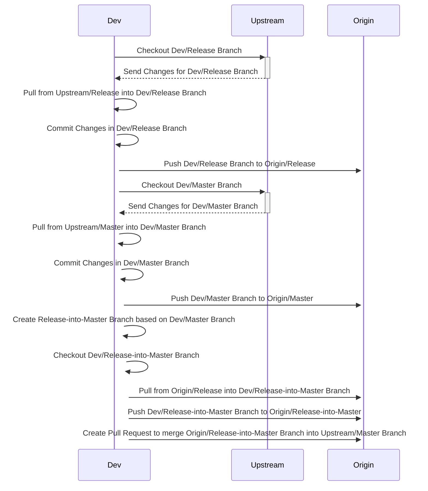

## Workflow release into master

Dies ist eine von vielen möglichen Methoden, um den Release in den Master-Branch zu integrieren. Der Vorteil dieser Methode besteht darin, dass sowohl die lokalen als auch die Origin-Branches auf den neuesten Stand gebracht werden

1. Checkout des Dev-Release-Branches
2. Pullen der Änderungen vom Upstream-Release-Branch in den lokalen Dev-Release-Branch
3. Commiten der Änderungen im lokalen Dev-Release-Branch
4. Pushen des Dev-Release-Branches in den Origin-Release-Branch
5. Checkout des Dev-Master-Branches
6. Pullen der Änderungen vom Upstream-Master-Branch in den lokalen Dev-Master-Branch
7. Commiten der Änderungen im lokalen Dev-Master-Branch
8. Pushen des Dev-Master-Branches in den Origin-Master-Branch
9. Erstellen eines neuen Branches mit dem Namen "release-into-master", der auf dem Dev-Master-Branch basiert, und Checkout des neuen Branches
10. Pullen der Änderungen vom Origin-Release-Branch in den neuen Branch "release-into-master"
11. Pushen des neuen Branches "release-into-master" in den Origin-Release-Into-Master-Branch
12. Erstellen eines Pull Requests, um die Änderungen vom Dev-Release-Branch in den Dev-Master-Branch zu übertragen

