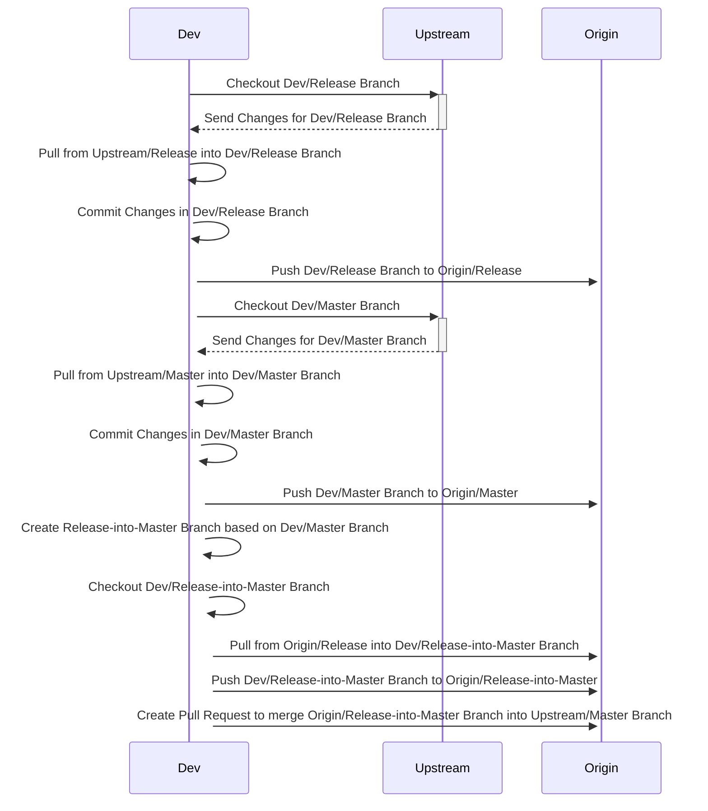

## Workflow release into master

This is one of many possible methods to integrate the release into the master branch. The advantage of this method is that both local and origin branches are updated to the latest state.

1. Checkout the Dev-Release branch.
2. Pull the changes from the upstream release branch into the local Dev-Release branch.
3. Commit the changes in the local Dev-Release branch.
4. Push the Dev-Release branch to the origin release branch.
5. Checkout the Dev-Master branch.
6. Pull the changes from the upstream master branch into the local Dev-Master branch.
7. Commit the changes in the local Dev-Master branch.
8. Push the Dev-Master branch to the origin master branch.
9. Create a new branch named "release-into-master" based on the Dev-Master branch and checkout the new branch.
10. Pull the changes from the origin release branch into the new "release-into-master" branch.
11. Push the new "release-into-master" branch to the origin release-into-master branch.
12. Create a pull request to merge the changes from the Dev-Release branch into the Dev-Master branch.

